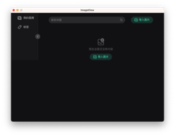
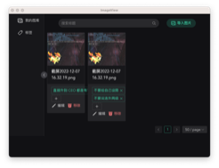
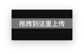

<h1 align="center">
  
  <br>
  Image Collect
  <br>
</h1>

<h3 align="center">
A <a href="https://github.com/ogromwang/imageCollect">Image Collect</a> GUI based on <a href="https://github.com/tauri-apps/tauri">tauri</a>.
</h3>

## Features

- [x] 监听操作系统拖拽事件弹窗
- [x] 拖拽即上传
- [x] 文件浏览
- [ ] 标签分类
- [ ] 色彩分类

## Install

从 [release](https://github.com/zzzgydi/clash-verge/releases) 进行下载。 支持 macOS 11+。

或自行编译 Windows x64, Linux x86_64

Notes: 如果无法在Windows上启动应用程序, 请检查一下你有没有安装 [Webview2](https://developer.microsoft.com/en-us/microsoft-edge/webview2/#download-section) 。

## Development

你应该安装 Rust 和 Nodejs，[查看更多信息](https://tauri.studio/docs/getting-started/prerequisites) 。 然后安装Nodejs包。

```shell
yarn install
```

然后执行

```shell
yarn tauri dev
```

构建

```shell
yarn tauri build
```

## Todos

> ...

## Screenshots

<div align="center">
  
  
  
</div>

## Disclaimer

这是 Rust 实践的学习项目。

## Contributions

## Acknowledgement

Image Collect 基于或受这些项目的启发，依此类推：

- [tauri-apps/tauri](https://github.com/tauri-apps/tauri): Build smaller, faster, and more secure desktop applications with a web frontend.
- [BD777/imageview](https://github.com/BD777/imageview): Image viewer by tauri

## License

MIT License. See [License here](./LICENSE) for details.